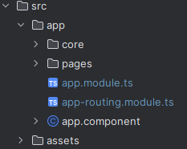
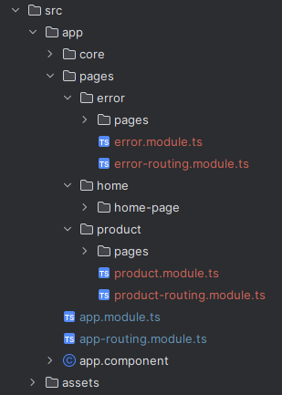

# Exemplo de uso de módulos e rotas no angular

## Introdução

Este projeto tem o objetivo de apresentar um exemplo rápido e completo sobre o uso de módulos e rotas no Angular.
#### Serão abordados os seguintes assuntos:
* **Módulos** - são uma maneira de organizar o código em pedaços menores e mais gerenciáveis; 
   * Carregamento direto de módulos, assim que a aplicação é iniciada;
   * Carregamento dinâmico de módulos com __lazy loading__;
* **Rotas** - permitem que você navegue entre diferentes partes do aplicativo;
   * Navegação por links usando ``routerLink``;
   * Navegação no código usando a classe ``Router`` do Angular;
   * Passagem de parâmetros usando ``ActivatedRoute ``;
   * Passagem de parâmetros usando ``withComponentInputBinding`` com ``provideRouter``;

## Baixando e executando o projeto:

1. Para fazer um clone do projeto, execute:

```shell
git clone https://github.com/rodrigossbr/angular-routes-complete-example.git
```

2. Para instalar os pacotes nescessários, execute

```shell
cd angular-routes-complete-example/
npm install
```

3. Para executar o projeto execute:

```shell
npm run start
```

4. Deve abrir o navegador padrão com a seguinte URL:
```shell
http://localhost:4200/home
```

# Antes de começar

### O que é lazy loading?
O lazy loading é uma técnica de carregamento sob demanda que permite que os módulos do Angular sejam carregados somente quando necessário.
Em outras palavras, em vez de carregar todos os módulos imediatamente, o lazy loading carrega apenas os módulos necessários para exibir a página atual.
Isso ajuda a manter o tamanho do pacote inicial menor e, portanto, a diminuir os tempos de carregamento.

Para mais informações sobre lazy loading no angular, acesse: [https://angular.io/guide/lazy-loading-ngmodules](https://angular.io/guide/lazy-loading-ngmodules)


## Estrutura do projeto

A estrutura do projeto foi pensada para apresentar um exemplo simples e objetivo.

* __src__
  * __app__
    * __core__ (Componentes que são usados por toda a aplicação)
      * __layouts__ (Módulo para componentes de layout)
      * __master-page__ (Módulo com componentes para uma master page)
    * __pages__ (Módulos de páginas)
      * __error__ (Módulo para páginas de erro, carregados conforme o uso, com lazy loading)
      * __home__ (Componentes da home, carregados de forma direta, sem lazy loading)
      * __product__ (Módulo para páginas de produtos, carregados conforme o uso, com lazy loading)
  * __assets__ (Arquivos de estilo e imagens)

## Vamos analisar

### Módulo principal 


Este módulo é onde tudo começa, é no arquivo ``app-routing.module.ts`` que definimos todas as rotas principais, como em:

~~~typescript
const routes: Routes = [
  {
    path: '',
    redirectTo: 'home',
    pathMatch: 'full'
  },
  {
    path: 'home',
    component: HomePageComponent,
  },
  {
    path: 'product',
    loadChildren: () => import('./pages/product/product.module').then((m) => m.ProductModule),
  },
  {
    path: 'error',
    loadChildren: () => import('./pages/error/error.module').then((m) => m.ErrorModule),
  },
  {
    path: '**',
    redirectTo: 'error',
  }
];

@NgModule({
  imports: [RouterModule.forRoot(routes)],
  exports: [RouterModule],
  providers: [
    provideRouter(routes, withComponentInputBinding()),
  ]
})
export class AppRoutingModule { }
~~~

1. `/home` Essa definição de rota é apenas um redirect para a página __home__ que é a página principal;
2. `/home` É a definição de rota para a página __home__, neste caso, como a página __home__ deve ser carregada imediatamente, __não__ usamos __lazy loading__;
3. `/product` É a definição de rota para o __módulo__ de produtos, neste caso, usamos __lazy loading__, onde o carregamento será feito quando a rota `/product` é acessada;
4. `/error` É a definição de rota para o __módulo__ de páginas de erros, , neste caso, usamos __lazy loading__, onde o carregamento será feito quando a rota `/error` é acessada;
5. `**` Essa definição é usada para redirecionar para o __módulo__ de erros quando é solicitada uma rota que não está definida no módulo principal ou nos __submódulos__;

Repare que para o módulo de rotas: ``AppRoutingModule`` deve ser importado no módulo principal:
~~~~typescript
@NgModule({
  declarations: [
    AppComponent,
    HomePageComponent
  ],
  imports: [
    BrowserModule,
    AppRoutingModule,
    MasterPageModule,
    LayoutsModule,
  ],
  providers: [],
  bootstrap: [AppComponent]
})
export class AppModule { }
~~~~

Para que tudo funcione, é preciso definir o componente que terá o ``<router-outlet>``, neste caso, o ``AppComponent``.

``app.component.html``
~~~~html
<app-template-master-page>
  <router-outlet></router-outlet>
</app-template-master-page>
~~~~

### Módulos da pasta _core_

* Módulo layouts
  * Este módulo é responsável por conter componentes de layouts que serão usados por outros módulos da aplicação, neste caso, como ele é usado por todos os módulos, é importado pelo módulo principal;
  * Para este exemplo, possui apenas o componente: ``app-body-header-page`` que serve para estilizar o título contido no corpo das páginas;
  
* Módulo master page
  * Este módulo é responsável por conter componentes usados para criar uma master page, ou seja a estrutura de página comum entre as páginas da aplicação;
  * Para este exemplo foram criados os seguintes componentes:
    * `app-header-page` este componente contém as definições e estilos do header principal;
    * `app-menu-page` este compomente contém as definições e estilos do menu lateral principal e também __links__ de navegação;
    * `app-template-master-page` este compomente contém os outros dois anteriores e a definição de onde deve ficar o corpo das páginas navegáveis ``<ng-content></ng-content>``, é usado no componente principal ``app.component.html``;
    
    ~~~~html
    <app-header-page
      (togleMenu)="togleMenu()"
    ></app-header-page>

      <div class="body-page">
        <app-menu-page
          [showMenu]="showMenu"
        ></app-menu-page>
        <div class="body-page-content">
          <ng-content></ng-content>
        </div>
      </div>  
      ~~~~

### Diretório _pages_

É neste diretório que criamos os submódulos para as demais rotas.



Repare que o diretório ``src/pages/home`` não contem uma definição de módulo. Isso é porque a página home não faz uso de __lazy loading__, então ela é importada no módulo principal.

* ``error`` este diretório é onde está definido o módulo das páginas de erro e suas rotas;

Definições das rotas no módulo: ``error-routing.module.ts``:
~~~~typescript
const routes: Routes = [
  {
    path: '',
    redirectTo: 'page-not-found',
    pathMatch: 'full'
  },
  {
    path: 'page-not-found',
    component: NotFoundPageComponent,
  }
];

@NgModule({
  imports: [RouterModule.forChild(routes)],
  exports: [RouterModule]
})
export class ErrorRoutingModule { }
~~~~

* ``home`` este diretório é onde devem ficar os componentes usados exclusivamente pela página home;

Aqui também temos o uso de navegação pela classe ``Router`` no componente: ``home-page.component.ts``:
~~~~typescript
@Component({
  selector: 'app-home-page',
  templateUrl: './home-page.component.html',
  styleUrls: ['./home-page.component.scss']
})
export class HomePageComponent {

  constructor(private router: Router) {}

  async goToProduct(id: number) {
    await this.router.navigate([`/product/${id}`]);
  }

  async goToProductDetails(id: number) {
    await this.router.navigate([`/product/${id}/details`]);
  }
}
~~~~

* ``product`` este diretório é onde fica o submódulo ``product`` e suas rotas;

Definições das rotas no módulo: ``product-routing.module.ts``:
~~~~typescript
const routes: Routes = [
  {
    path: ':id',
    component: ProductPageComponent,
  },
  {
    path: ':id/details',
    component: ProductDetailsPageComponent,
  }
];

@NgModule({
  imports: [RouterModule.forChild(routes)],
  exports: [RouterModule],
})
export class ProductRoutingModule { }
~~~~

No submódulo ``product-routing.module.ts`` podemos ver as definições de parametro de entrada para as rotas de `product`, que são definidas no módulo principal.

Fragmento da definição da rota ``product`` no módulo principal ``app-routing.module.ts``, onde o carregamento do módulo é feito com uso de ``lazy loading``:
~~~~typescript
{
    path: 'product',
    loadChildren: () => import('./pages/product/product.module').then((m) => m.ProductModule),
}
~~~~

Com esta definição, podemos usar rotas como: ``/product/1`` ou ``/product/1/details``.

Na sequência, veremos duas formas de acessar de dentro do componente, o ``:id`` que é informado na rota.

1. Usando ``withComponentInputBinding`` com ``provideRouter``:

A definição do provider deve ser feita no módulo de rotas principal ``app-routing.module.ts``:
~~~~typescript
@NgModule({
  imports: [RouterModule.forRoot(routes)],
  exports: [RouterModule],
  providers: [
    provideRouter(routes, withComponentInputBinding()),
  ]
})
export class AppRoutingModule { }
~~~~

Dessa forma, conseguimos acessar o parâmetro diretamente através de um ``@Input()`` no componente.

Exemplo de acesso ao parâmetro no componente: ``product-page.component.ts``:
~~~~typescript
@Component({
  selector: 'app-product-page',
  templateUrl: './product-page.component.html',
  styleUrls: ['./product-page.component.scss']
})
export class ProductPageComponent {

  productId!: number;

  @Input()
  set id(productId: number) {
    this.productId = productId;
  }
}
~~~~

2. Usando ``ActivatedRoute`` dentro do componente:

Dessa forma, precisamos injetar a classe ``ActivatedRoute`` dentro do componente para acessar o parâmetro.

Exemplo de acesso ao parâmetro no componente: ``product-details-page.component.ts``:
~~~~typescript
@Component({
  selector: 'app-product-details-page',
  templateUrl: './product-details-page.component.html',
  styleUrls: ['./product-details-page.component.scss']
})
export class ProductDetailsPageComponent implements OnInit {

  productId!: number;

  constructor(private route: ActivatedRoute) {}

  ngOnInit(): void {

    this.route.paramMap.subscribe(paramMap => {
      this.productId = Number(paramMap.get('id'));
    })
  }
}

~~~~

# Contato
 
Para dúvidas, melhorias ou sugestões, podem entrar em contato que vou tentar responder o mais rápido possível.

[Rodrigo S. Santos](https://github.com/rodrigossbr) _(rodrigoss.br@gmail.com)_
